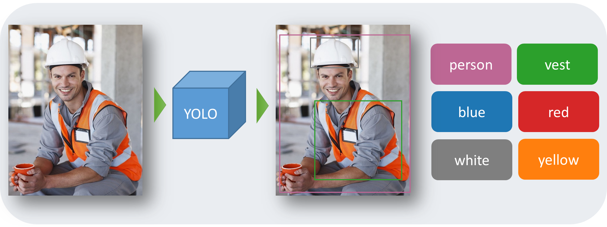
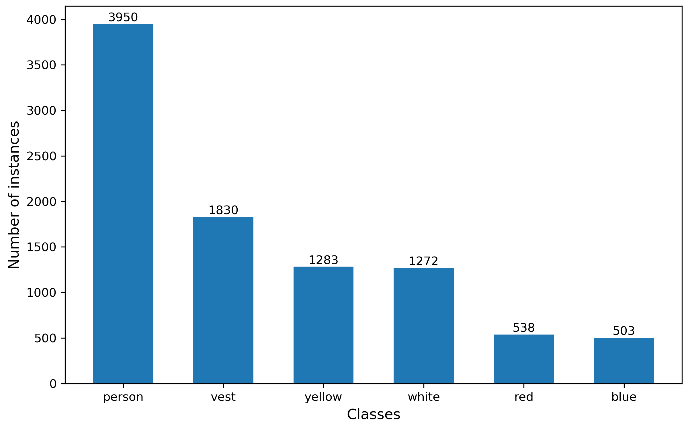
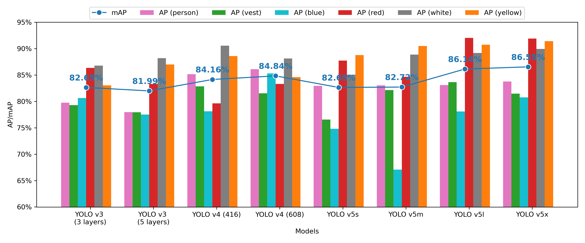
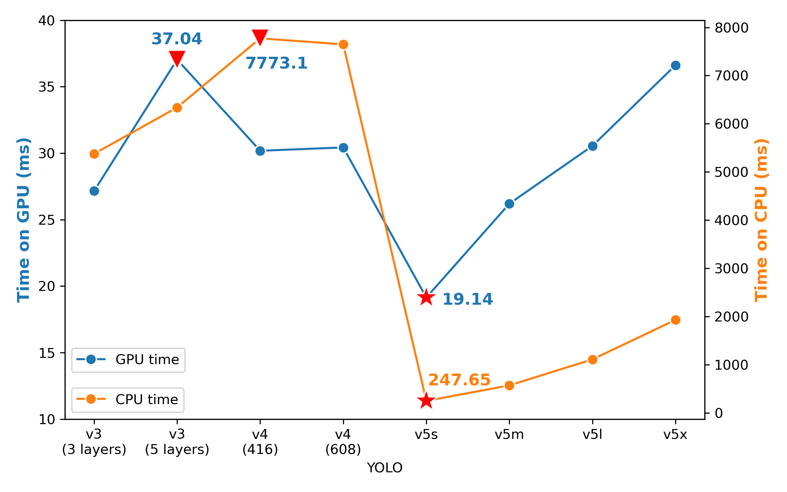

# Real-time PPE Detection & Open Dataset ([Open Access paper link](https://www.mdpi.com/1424-8220/21/10/3478))

## Introduction

The repository introduces eight DL models built on You Look Only Once (YOLO) architecture for PPE detection. Meanwhile, a novel high-quality dataset is constructed for detecting the person, the vest, and four helmet colors.

## Framework

## CHV Dataset

A novel dataset  is constructed for detecting the helmet, the helmet colors and the person for this project, named **Color Helmet and Vest (CHV)** dataset. 

Instead of just accepting exiting images, strict criteria are designed at the beginning, and only  1,330 high-quality images among 10,000 ones from the Internet and open datasets are selected. 

The dataset is open for free use, please download at [Google Drive](https://drive.google.com/file/d/1fdGn67W0B7ShpBDbbQpUF0ScPQa4DR0a/view?usp=sharing) or [Baidu Yunpan (password: f003)](https://pan.baidu.com/s/1G9EbLKUgF1tcOPCeWSEeMw ). 

If the dataset helpes you, please cite the repository in your article:

`
@Article{wang2021ppe,
AUTHOR = {Wang, Zijian and Wu, Yimin and Yang, Lichao and Thirunavukarasu, Arjun and Evison, Colin and Zhao, Yifan},
TITLE = {Fast Personal Protective Equipment Detection for Real Construction Sites Using Deep Learning Approaches},
JOURNAL = {Sensors},
VOLUME = {21},
YEAR = {2021},
NUMBER = {10},
ARTICLE-NUMBER = {3478},
URL = {https://www.mdpi.com/1424-8220/21/10/3478},
ISSN = {1424-8220},
DOI = {10.3390/s21103478}
}`

Or
	
`Wang, Z.; Wu, Y.; Yang, L.; Thirunavukarasu, A.; Evison, C.; Zhao, Y. Fast Personal Protective Equipment Detection for Real Construction Sites Using Deep Learning Approaches. Sensors 2021, 21, 3478. https://doi.org/10.3390/s21103478`

## Results

- **YOLO v5x owns the best mAP, 86.55%.**
- **YOLO v5s has the faster processing speed, 52 FPS.**
- For YOLO v3 models, different detection layers are tested, while the more layers cannot improve the performance. 
- For YOLO v4 models,  the increase of training image size cannot contribute to better performance. 

 

Figure: Mean average precision in each model.

Figure: Average time for processing one image in each model (GPU: Tesla P40 with 24 GB; CPU: 4 cores with 8 GB). 

## 
If you are interested in my work, please visit <https://zijianwang1995.github.io/>
